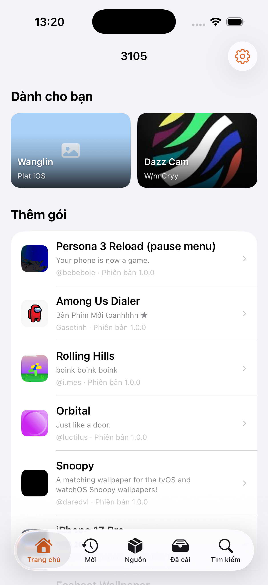
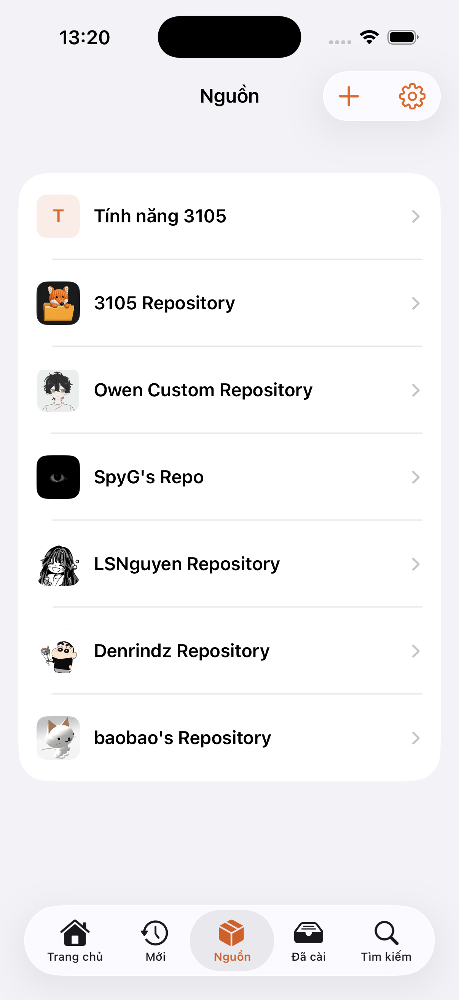
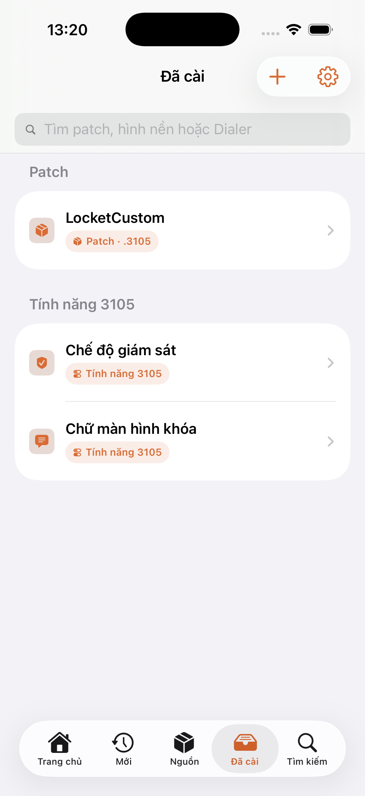

<p align="center">
  
</p>

<h1 align="center">3105</h1>

<p align="center">
  An iOS content hub and manager for patches, app data, dialer themes, and PosterBoard wallpapers.
</p>

<p align="center">
  
  
  
  
</p>

<p align="center">
  <a href="README.vi.md">Tiếng Việt</a> ·
  <a href="docs/PATCH_GUIDE.md">Patch guide</a> ·
  <a href="#compatibility">Compatibility</a> ·
  <a href="#license">License</a>
</p>

> [!WARNING]
> 3105 is research software for personal device management. Keep a backup and use it only on devices and data you own. Simulator screenshots demonstrate UI only; they do not verify device-level access.

## Preview

<p align="center">
  
  &nbsp;
  
  &nbsp;
  
</p>

## What's new in 2.0

- **A new content marketplace** — discover patches, wallpapers, dialer themes, and 3105 features from For You, New, or individual sources, with clear download progress and installation results.
- **A simpler Installed library** — manage every downloaded item in one place, with its name, icon, and content type. Update indicators appear when a newer package is available.
- **More flexible patches** — one patch can target multiple apps and App Groups, find the matching data on each device, and apply the portions available on that device.
- **User-configurable patches** — creators can expose text fields, switches, and choices. Patches can replace files, edit plist/JSON content, and optionally use a password.
- **Safer recovery** — improved backup, reset, restore, and active-patch removal flows, with clearer feedback after every action.
- **Dialer themes** — `.3105pass` packages can follow the light, dark, and bold keypad style detected on the device.
- **Repository wallpapers** — download and manage `.tendies` packages in the app, view images inside package descriptions, and remove installed wallpapers from Installed.
- **A redesigned Files experience** — clear Workspace, Application, and App Group areas, plus hidden files, tabs, favorites, file information, and a simple plist editor.
- **Installable 3105 features** — Cleaner can be installed or removed like other content; supported iOS 27 builds also offer Lock Screen Footnote and Supervised mode.
- **Clearer interface and status** — Home, Sources, package details, and Installed now share one visual language and explain compatibility, downloads, installation, and errors more clearly.

Compared with 1.1.1, version 2.0 turns 3105 from a collection of separate tools into one place to discover, install, and manage content.

## Highlights

- **Repository marketplace** — browse multiple sources and install supported content directly in 3105.
- **Installed library** — keep patches, wallpapers, dialer themes, and 3105 features together with clear type labels and package icons.
- **Application and App Group browser** — locate app data by a recognizable app name or stable identifier.
- **File operations** — search, preview, share, import, copy, move, rename, delete, create and extract ZIP archives, use tabs, and save favorites.
- **Portable `.3105` patches** — target multiple apps or App Groups, expose user choices, use optional passwords, and restore original files after use.
- **Additional packages** — install `.3105pass` dialer themes, `.tendies` wallpapers, and built-in 3105 features.
- **No jailbreak installation** — 3105 does not install a persistent jailbreak, bootstrap, or daemon and does not inject code into third-party apps. Because it still uses device exploits and can modify app data, no universal guarantee can be made against every app's integrity or jailbreak-detection policy.
- **Localized interface** — English, Vietnamese, and Simplified Chinese.

## Compatibility

3105 enables device-level features only for builds explicitly verified by the project:

| System | Verified range/builds |
| --- | --- |
| iOS 17 | 17.0 through 17.7 (kernel exploit) |
| iOS 18 | 18.0 through 18.7.1 (kernel exploit) |
| iOS 26 | 26.0 through 26.6.1 |
| iOS 27 Developer Beta 1 | `24A5355q` |
| iOS 27 Developer Beta 2 | `24A5370h` |
| iOS 27 Developer Beta 3 / Public Beta 1 | `24A5380h` |
| iOS 27 Developer Beta 4 / Public Beta 2 | `24A5390f` |

Unlisted iOS 27 builds are marked unsupported rather than assumed compatible. The iOS 17–18 kernel exploit is opt-in (manual button) because a failed exploit attempt may restart the app.

## Installation notes

- Device functionality requires signing with an **enterprise certificate**.
- SideStore, AltStore, 3uTools, and LiveContainer are not supported installation paths.
- The target bundle identifier is intentionally `com.apple.mobile.MobileHouseArrest`; changing it can break the MHA-C2 app-container workflow.
- The source tree does not contain certificates, provisioning profiles, signed applications, or IPA files; release assets may provide an unsigned IPA.

## Project layout

```text
3105/
├── ThreeOneOSFive/          # SwiftUI app, helpers, native bridges, localizations
├── ThreeOneOSFive.xcodeproj # Xcode project and 3105 scheme
└── docs/images/             # Repository artwork and current UI previews
```

## Security and responsible use

Do not publish logs, app containers, cookies, account databases, or patch payloads containing personal data. Report security-sensitive issues privately to the maintainer.

## Credits

3105 is developed and designed by [YangJiii](https://x.com/duongduong0908).

Special thanks to [0xjohnny](https://x.com/0xjohnny) for [FilzaSlop](https://github.com/0xjohnnydev/FilzaSlop) and related research:

- [MobileHouseArrest-PoC](https://github.com/0xjohnnydev/MobileHouseArrest-PoC) — ContainerManager identity-trust bug
- [Geod-MCM-PoC](https://github.com/0xjohnnydev/Geod-MCM-PoC) — `geod` MobileContainerManager `partDomain` traversal
- [InstallCoordination-PoC](https://github.com/0xjohnnydev/InstallCoordination-PoC) — persisted-state and final-symlink chain
- [CFPrefsZeroFile-PoC](https://github.com/0xjohnnydev/CFPrefsZeroFile-PoC) — `cfprefsd` zero-file creation

The project also builds on work from Pocket Poster/Nugget, CrazyMind90, forcequitOS, Dopamine, and their contributors. See [THIRD_PARTY_NOTICES.md](THIRD_PARTY_NOTICES.md) for full attribution and upstream links.

## License

Original portions of 3105 are distributed under the [GNU General Public License v3.0](LICENSE). Third-party components remain subject to their respective upstream copyright and license terms; see [THIRD_PARTY_NOTICES.md](THIRD_PARTY_NOTICES.md).
